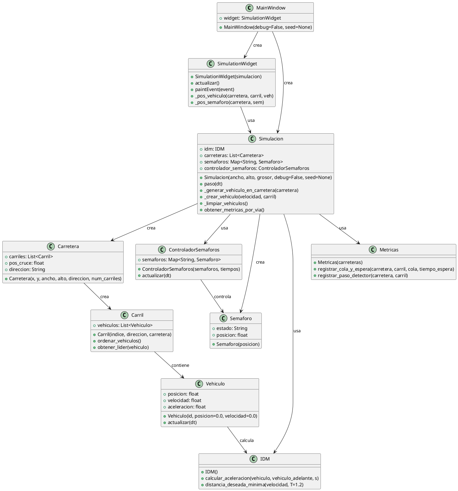
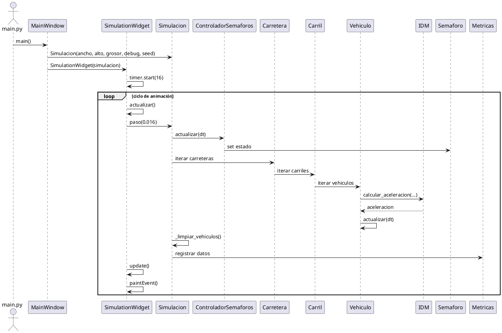
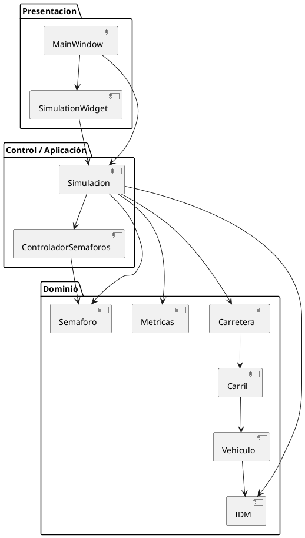

# UML - Arquitectura de Software

Este documento contiene los diagramas UML que muestran tu diseño modular actual.

## 1. Diagrama de Clases

## 2. Diagrama de Secuencia

## 3. Notas de diseño modular

- **`presentacion/`** contiene solo UI y refresco visual.
- **`control/`** orquesta el ciclo de simulación y la lógica de actualización.
- **`dominio/`** define entidades de negocio: `Vehiculo`, `Carretera`, `Carril`, `Semaforo`, `IDM` y `Metricas`.
- El acoplamiento se mantiene bajo gracias a que `Simulacion` usa el dominio y expone una interfaz simple a la UI.
- El flujo de datos va de la UI hacia el dominio a través de `Simulacion.paso()`, y luego retorna al widget para dibujar el estado actualizado.

## 4. Diagrama de Arquitectura por Capas

