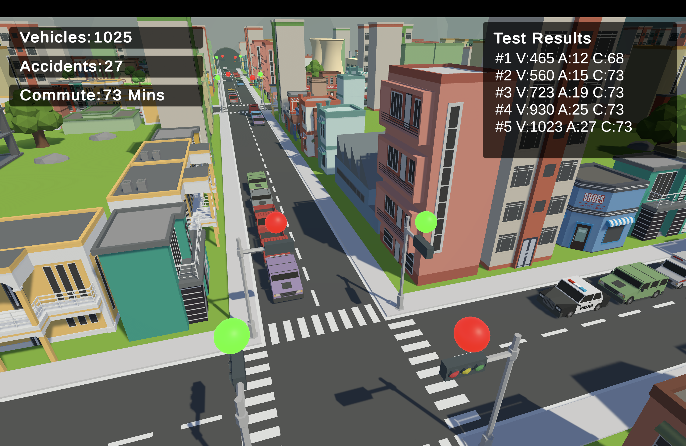
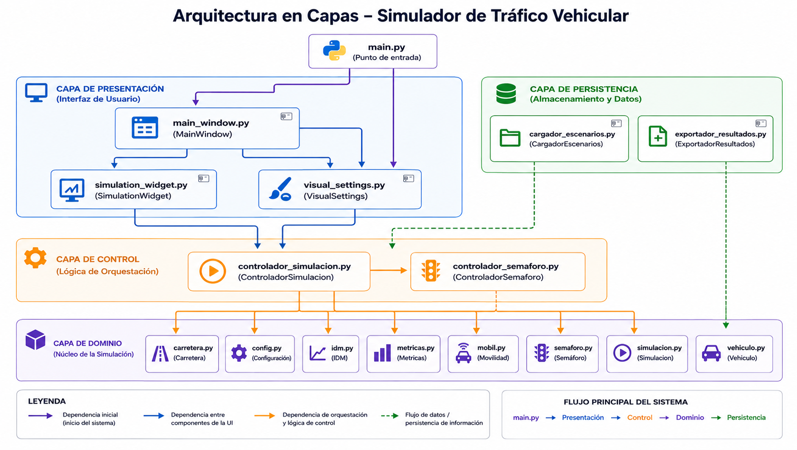
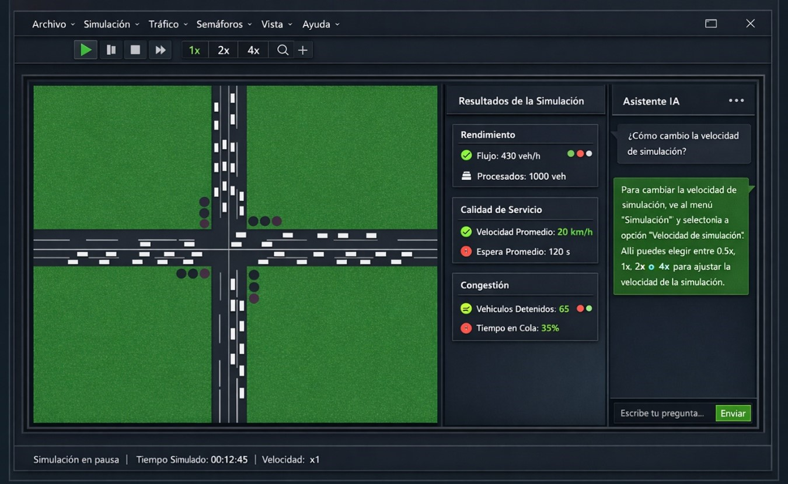
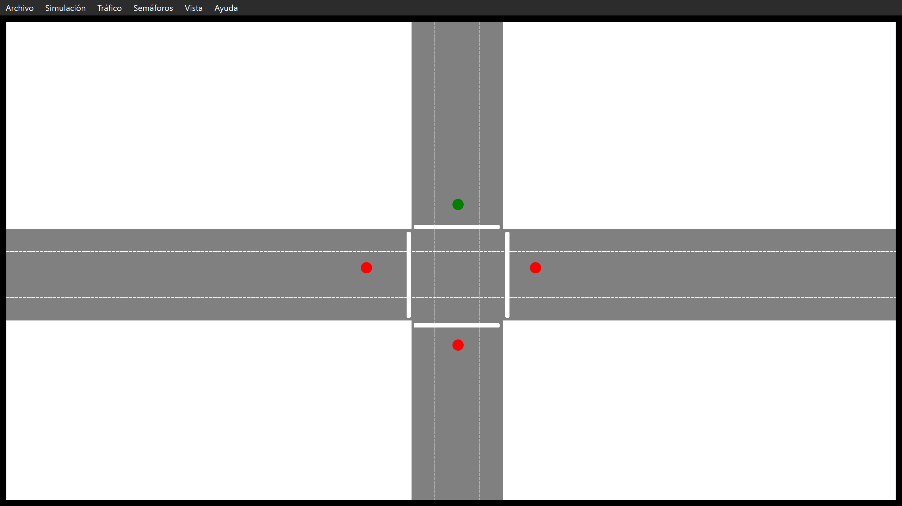
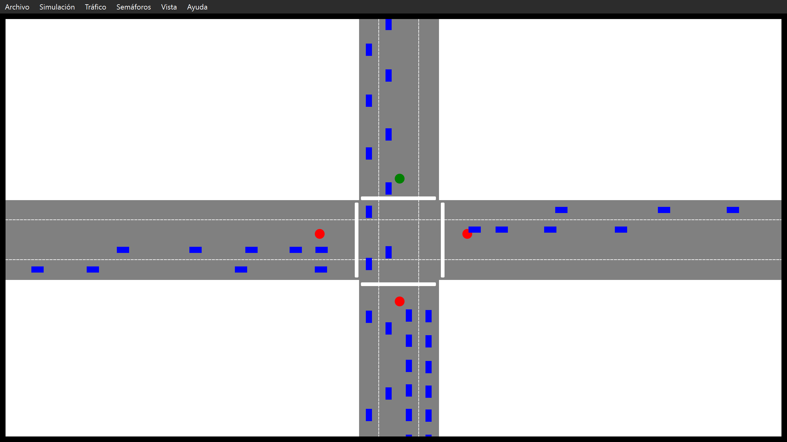

<h1 align="center">🚦 Simulador Microscópico de Tráfico</h1>
<h3 align="center">Proyecto de grado aprobado — Universidad Cooperativa de Colombia</h3>

<!-- 📌 Banner principal -->

  

<b>Título:</b> Desarrollo de un Simulador Microscópico de Tráfico Para el Análisis de Tiempos Semafóricos en Intersecciones Críticas de Santa Marta, Colombia 
<b>Autor:</b> Juan Alberto Arévalo Cáceres

<h2>📘 Descripción General</h2>

Este proyecto implementa un <b>simulador microscópico de tráfico vehicular</b>, capaz de modelar el comportamiento individual de cada vehículo en una vía, considerando aceleración, interacción con el líder, distancia de seguridad, velocidad objetivo y dinámica de flujo.

El objetivo principal es desarrollar un simulador basado en un <b>modelo matemático de comportamiento vehicular</b> que permita analizar el desempeño de <b>intersecciones semaforizadas</b> bajo configuraciones de tiempos fijos.

Este repositorio público contiene:

<ul>
  <li>Arquitectura del sistema</li>
  <li>Código no sensible (GUI, control, loaders, configuración, semáforos, métricas)</li>
  <li>Resultados y visualizaciones</li>
  <li>Material multimedia del simulador funcionando</li>
</ul>

<b>⚠️ Nota:</b> El motor matemático completo (IDM, ecuaciones internas y algoritmos) no se incluye para proteger la propiedad intelectual del autor.

<h2>🧠 Modelo Microscópico (IDM)</h2>

El simulador se basa en el <b>Intelligent Driver Model (IDM)</b>, donde cada vehículo es una entidad independiente con:

<ul>
  <li>Posición</li>
  <li>Velocidad</li>
  <li>Aceleración</li>
  <li>Distancia objetivo</li>
  <li>Tiempo de reacción</li>
  <li>Velocidad deseada</li>
</ul>

El modelo utiliza:

<ul>
  <li>Ecuaciones diferenciales discretizadas</li>
  <li>Actualización por pasos de tiempo</li>
  <li>Funciones de aceleración dependientes del entorno local</li>
  <li>Control de colisiones y estabilidad numérica</li>
</ul>

La documentación completa se encuentra en el repositorio institucional de la UCC.  
Este repositorio presenta un resumen técnico y la arquitectura general del sistema.

<h2>🏗️ Arquitectura del Sistema</h2>

<h3>Arquitectura en Capas</h3>

El simulador está diseñado siguiendo una arquitectura modular en capas:

<ol>
  <li><b>Capa de Presentación (GUI):</b> Visualización gráfica del entorno, vehículos, semáforos y métricas en tiempo real.</li>
  <li><b>Capa de Control:</b> Coordina el ciclo de simulación, gestiona semáforos y acciones del usuario.</li>
  <li><b>Capa de Dominio (Núcleo del Simulador):</b> Vehículos, semáforos, carretera y modelos matemáticos (IDM).  
       <b>Esta capa no se incluye en el repositorio público.</b></li>
  <li><b>Capa de Persistencia:</b> Carga de escenarios, parámetros y exportación de resultados.</li>
</ol>

<h3>Componentes Principales</h3>
<ul>
  <li><b>Simulación:</b> Control general del ciclo de actualización.</li>
  <li><b>Vehículos:</b> Entidades independientes que implementan el modelo IDM.</li>
  <li><b>Semáforos:</b> Fases, tiempos y sincronización.</li>
  <li><b>Carretera:</b> Carriles, intersecciones y conexiones.</li>
  <li><b>Métricas:</b> Flujo, densidad, tiempos de espera, velocidad promedio.</li>
  <li><b>GUI:</b> Visualización en tiempo real.</li>
  <li><b>Loaders:</b> Carga de escenarios y parámetros.</li>
</ul>

<h3>Diagrama General</h3>

<!-- 📌 Imagen del diagrama -->

  

<pre>
+------------------------------+
|        Interfaz (GUI)        |
+---------------+--------------+
                |
                v
+------------------------------+
|         Controlador          |
|  (Simulación + Semáforos)    |
+---------------+--------------+
                |
                v
+------------------------------+
|         Modelo IDM           |
|  (Vehículos + Interacciones) |
+---------------+--------------+
                |
                v
+------------------------------+
|          Métricas            |
+------------------------------+
                |
                v
+------------------------------+
|          Resultados          |
+------------------------------+
</pre>

<h2>📊 Resultados y Visualizaciones</h2>

<h3>Panel Futuro (en construcción)</h3>

  

<h3>Panel Actual (versión operativa)</h3>

  

<h3>Demostración del Simulador</h3>

  

<h2>📁 Estructura del Proyecto</h2>

<pre>
/traffic-simulation-microscopic
│
├── control/                
├── presentacion/            
├── persistencia/              
├── main.py  
└── README.md
</pre>

<b>Nota:</b> La carpeta <code>dominio/</code> no se incluye en este repositorio público.

<h2>🐍 Instalación del Entorno Virtual</h2>

<ol>
  <li>Crear entorno virtual: <code>python -m venv env</code></li>
  <li>Activar entorno virtual: <code>env\Scripts\activate</code></li>
  <li>Desactivar: <code>deactivate</code></li>
</ol>

<h2>📦 Instalar Dependencias</h2>
<pre>pip install -r requirements.txt</pre>

<h2>▶️ Ejecutar el Simulador</h2>
<pre>python main.py</pre>

<h2>📄 Acceso al Código Completo</h2>

El motor de simulación completo (IDM, ecuaciones internas y algoritmos) se encuentra en un repositorio privado del autor.  
Disponible únicamente para revisión profesional bajo solicitud.

<h2>✉️ Contacto</h2>

<b>Juan Alberto Arévalo Cáceres</b> 
📧 alberjuan2411@gmail.com 
📞 +57 3016482354 🇨🇴

